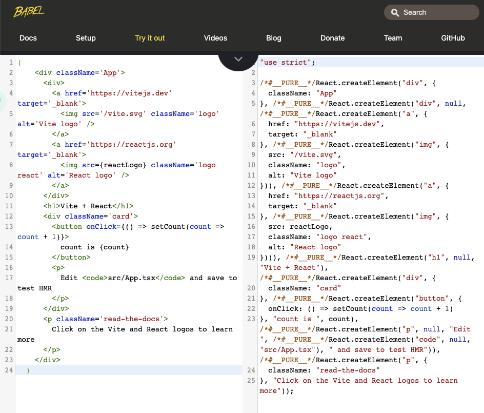
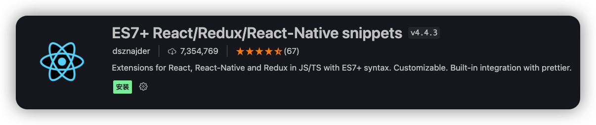
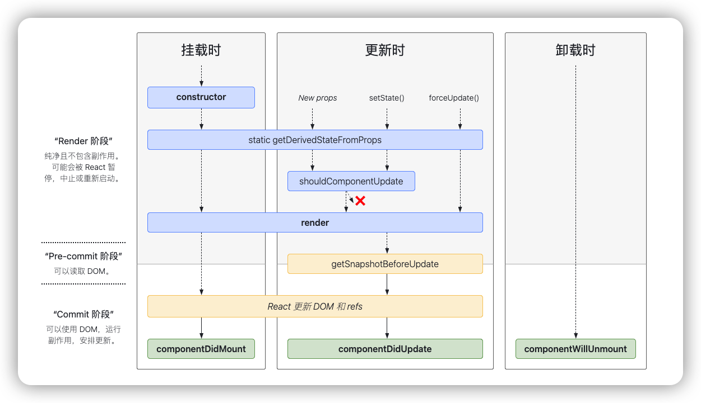

# React

<p align="center"><svg xmlns="http://www.w3.org/2000/svg" xmlns:xlink="http://www.w3.org/1999/xlink" aria-hidden="true" role="img" class="iconify iconify--logos" width="165.93" height="162" preserveAspectRatio="xMidYMid meet" viewBox="0 0 256 228"><path fill="#00D8FF" d="M210.483 73.824a171.49 171.49 0 0 0-8.24-2.597c.465-1.9.893-3.777 1.273-5.621c6.238-30.281 2.16-54.676-11.769-62.708c-13.355-7.7-35.196.329-57.254 19.526a171.23 171.23 0 0 0-6.375 5.848a155.866 155.866 0 0 0-4.241-3.917C100.759 3.829 77.587-4.822 63.673 3.233C50.33 10.957 46.379 33.89 51.995 62.588a170.974 170.974 0 0 0 1.892 8.48c-3.28.932-6.445 1.924-9.474 2.98C17.309 83.498 0 98.307 0 113.668c0 15.865 18.582 31.778 46.812 41.427a145.52 145.52 0 0 0 6.921 2.165a167.467 167.467 0 0 0-2.01 9.138c-5.354 28.2-1.173 50.591 12.134 58.266c13.744 7.926 36.812-.22 59.273-19.855a145.567 145.567 0 0 0 5.342-4.923a168.064 168.064 0 0 0 6.92 6.314c21.758 18.722 43.246 26.282 56.54 18.586c13.731-7.949 18.194-32.003 12.4-61.268a145.016 145.016 0 0 0-1.535-6.842c1.62-.48 3.21-.974 4.76-1.488c29.348-9.723 48.443-25.443 48.443-41.52c0-15.417-17.868-30.326-45.517-39.844Zm-6.365 70.984c-1.4.463-2.836.91-4.3 1.345c-3.24-10.257-7.612-21.163-12.963-32.432c5.106-11 9.31-21.767 12.459-31.957c2.619.758 5.16 1.557 7.61 2.4c23.69 8.156 38.14 20.213 38.14 29.504c0 9.896-15.606 22.743-40.946 31.14Zm-10.514 20.834c2.562 12.94 2.927 24.64 1.23 33.787c-1.524 8.219-4.59 13.698-8.382 15.893c-8.067 4.67-25.32-1.4-43.927-17.412a156.726 156.726 0 0 1-6.437-5.87c7.214-7.889 14.423-17.06 21.459-27.246c12.376-1.098 24.068-2.894 34.671-5.345a134.17 134.17 0 0 1 1.386 6.193ZM87.276 214.515c-7.882 2.783-14.16 2.863-17.955.675c-8.075-4.657-11.432-22.636-6.853-46.752a156.923 156.923 0 0 1 1.869-8.499c10.486 2.32 22.093 3.988 34.498 4.994c7.084 9.967 14.501 19.128 21.976 27.15a134.668 134.668 0 0 1-4.877 4.492c-9.933 8.682-19.886 14.842-28.658 17.94ZM50.35 144.747c-12.483-4.267-22.792-9.812-29.858-15.863c-6.35-5.437-9.555-10.836-9.555-15.216c0-9.322 13.897-21.212 37.076-29.293c2.813-.98 5.757-1.905 8.812-2.773c3.204 10.42 7.406 21.315 12.477 32.332c-5.137 11.18-9.399 22.249-12.634 32.792a134.718 134.718 0 0 1-6.318-1.979Zm12.378-84.26c-4.811-24.587-1.616-43.134 6.425-47.789c8.564-4.958 27.502 2.111 47.463 19.835a144.318 144.318 0 0 1 3.841 3.545c-7.438 7.987-14.787 17.08-21.808 26.988c-12.04 1.116-23.565 2.908-34.161 5.309a160.342 160.342 0 0 1-1.76-7.887Zm110.427 27.268a347.8 347.8 0 0 0-7.785-12.803c8.168 1.033 15.994 2.404 23.343 4.08c-2.206 7.072-4.956 14.465-8.193 22.045a381.151 381.151 0 0 0-7.365-13.322Zm-45.032-43.861c5.044 5.465 10.096 11.566 15.065 18.186a322.04 322.04 0 0 0-30.257-.006c4.974-6.559 10.069-12.652 15.192-18.18ZM82.802 87.83a323.167 323.167 0 0 0-7.227 13.238c-3.184-7.553-5.909-14.98-8.134-22.152c7.304-1.634 15.093-2.97 23.209-3.984a321.524 321.524 0 0 0-7.848 12.897Zm8.081 65.352c-8.385-.936-16.291-2.203-23.593-3.793c2.26-7.3 5.045-14.885 8.298-22.6a321.187 321.187 0 0 0 7.257 13.246c2.594 4.48 5.28 8.868 8.038 13.147Zm37.542 31.03c-5.184-5.592-10.354-11.779-15.403-18.433c4.902.192 9.899.29 14.978.29c5.218 0 10.376-.117 15.453-.343c-4.985 6.774-10.018 12.97-15.028 18.486Zm52.198-57.817c3.422 7.8 6.306 15.345 8.596 22.52c-7.422 1.694-15.436 3.058-23.88 4.071a382.417 382.417 0 0 0 7.859-13.026a347.403 347.403 0 0 0 7.425-13.565Zm-16.898 8.101a358.557 358.557 0 0 1-12.281 19.815a329.4 329.4 0 0 1-23.444.823c-7.967 0-15.716-.248-23.178-.732a310.202 310.202 0 0 1-12.513-19.846h.001a307.41 307.41 0 0 1-10.923-20.627a310.278 310.278 0 0 1 10.89-20.637l-.001.001a307.318 307.318 0 0 1 12.413-19.761c7.613-.576 15.42-.876 23.31-.876H128c7.926 0 15.743.303 23.354.883a329.357 329.357 0 0 1 12.335 19.695a358.489 358.489 0 0 1 11.036 20.54a329.472 329.472 0 0 1-11 20.722Zm22.56-122.124c8.572 4.944 11.906 24.881 6.52 51.026c-.344 1.668-.73 3.367-1.15 5.09c-10.622-2.452-22.155-4.275-34.23-5.408c-7.034-10.017-14.323-19.124-21.64-27.008a160.789 160.789 0 0 1 5.888-5.4c18.9-16.447 36.564-22.941 44.612-18.3ZM128 90.808c12.625 0 22.86 10.235 22.86 22.86s-10.235 22.86-22.86 22.86s-22.86-10.235-22.86-22.86s10.235-22.86 22.86-22.86Z"></path></svg></p>

### 了解 React 18.x

- 🎢 声明式编写 UI【Vue、小程序、React、Flutter】响应式 `UI = render(state)`
- 🛟 组件化开发

- 🛵 使用 Node 进行服务端渲染(SSR)
- 🚁 使用 React Native 开发原生移动应用程序
- 🎑 2017 年 Facebook 推出的 ReactVR, 开发虚拟现实 Web 应用程序

**开发依赖 📝：**

- react：核心代码
- react-dom：渲染不同平台所需的核心代码
  - web 端：react-dom 将 jsx 最终渲染成真实的 DOM, 显示浏览器中
  - native 端：react-dom 将 jsx 最终渲染成原生的移动程序控件
- babel：jsx 转化 react 代码的工具(jsx 语法转化 React.creatElement)

```js
import React from "react";
import ReactDOM from "react-dom/client"; // 注意导出路径

// Before 18.x
ReactDOM.render(<div>React</div>, document.querSelector("#root"));

// After 18.x
const app = ReactDOM.creatRoot(document.querSelector("#root"));
app.render(<div>React</div>);
```

#### **类 class 和函数式组件 📖**

**class 组件：**

```js
// 通过 class 并且继承 React.Component 来创建组件
class App extends React.Component {
  // ...数据初始化,继承父类调用(可选：如果不需要初始化数据则不需要实现 constructor)
  constructor(props) {
    super(props);

    // ...通常在这里初始化 state
    // ...通常在这里对组件的方法 this 提前绑定
    this.handelClick = this.handelClick.bind(this);
  }

  // ...组件方法
  handelClick() {
    // react 会对 this.setState() 传入的对象进行“合并”
    this.setState({ count: 1 });

    // ⚠️ 在当前函数被调用时, 函数内的 this 指向不一定是当前组件的实例对象(作为 jsx 方法回调(指针传递)默认是 undefined), 所以需要手动绑定 this, 或者🟢使用 react 的实验性语法 class fields handelClick = () => {} , 或者🟢z在 JSX 中事件回调中使用箭头函数
    // e.g. setTimeout(this.handelClick, 1000); // Wrong
    // e.g. const app = new App(); const handelClick = app.handelClick; handelClick(); this 指向就不是 App 的实例对象
    // e.g. <button onClick={() => this.handelClick()}>Click me</button>
    // ⚠️ setState 有可能是异步的,出于性能考虑,react 会将多个 setState() 的调用合并成一个,所以在这里不能依赖 this.state.count 的值来更新
    this.setState({ count: this.state.count + 1 }); // Wrong

    // 🟢 正确的做法是使在 setState 传入一个回调函数, 在 setState(callback) 中, callback 的第一个参数是上一次的 state, 第二个参数是上一次的 props
    this.setState((state, props) => {
      return { count: state.count + 1 };
    }); // Correct
  }

  // ...渲染内容的 render 方法(class 唯一必须要实现的方法) ,返回的 jsx 就是 react 的虚拟 DOM
  render() {
    return <div>{("any[]", "cannot be Object")}</div>;
  }
}
```

**函数式：**

```js
// 同样需要大写驼峰命名,不需要继承 React.Component
function App (){}

// 📝 没有 Hook 下
- 虽然会被更新挂载, 但是没有生命周期 🥽
- this 关键字不能指向组件实例(因为没有组件实例)
- 没有内部状态(State)
```

> Event
> event 对象与原生的传递方法相似 ,但是 React 的 event 对象是被 React 封装过的
>
> **React 18.x 开始 setState 默认异步 🎢**

- event.preventDefault() 阻止默认行为(React 需要手动调用阻止默认行为)
- bind 绑定 this 时需要注意 参数传递问题
- 当需要传递多个参数时 ,建议使用箭头函数

```js
// e.g.
<button onClick={this.handelClick.bind(this, '参数')}>Click me</button>

// 此时 event 参数会被传递到 handelClick 方法中的第二个参数中
handelClick(arg, event) {
  console.log(arg); // '参数'
}


// e.g.
handleClick = function (e) {
  console.log(this); // undefined
}

handleChange = handleClick.bind(this, '参数');
handleChange(event) // 需要在第二个参数中才能获取 event 对象
```

**列表渲染 🥽：**

元素的 key 只有放在就近的数组上下文中才有意义。
比方说, 如果提取出一个 ListItem 组件, 应该把 key 保留在数组中的这个 <ListItem /> 元素上, 而不是放在 ListItem 组件中的 <li> 元素上。

```js
function ListItem(props) {
  // 正确！这里不需要指定 key：
  return <li>{props.value}</li>;
  // return <li key={ props.value }>{props.value}</li>;
}

function NumberList(props) {
  const numbers = props.numbers;
  const listItems = numbers.map((number) => (
    // 正确！key 应该在数组的上下文中被指定
    <ListItem key={number.toString()} value={number} />
  ));
  return <ul>{listItems}</ul>;
}
```

> ⚠️ 组件名称必须是首字母大写的驼峰命名 , 例如：`<App />` , 否则 react 会认为是原生的 html 标签

如何存放组件的数据和方法呢？

- 通过 `this.state` 存放的数据通常是需要动态更新的数据
- 通过 `this.props` 存放的数据通常是父组件传递过来的数据(只读)
- 通过 `this.handelClick` 存放的方法通常是组件的事件处理方法(⚠️ this 指向问题)

`this.setState`做了什么？

- 更新组件的 state
- 自动调用 render 方法重新渲染组件

**JSX 语法 🎲：**
`JSX` 是 `JavaScript` 的语法扩展, 用来描述 `UI` 的长得像 `HTML` , 但是实际上是 `JavaScript` 语法的一种扩展

> 转换：`const element = <h1>🚣</h1>` => `React.createElement('h1', null, '🚣')`
> element 是一个对象, 有 type, props, key, ref 等属性,它不是一个字符串不是一个 DOM 元素,它是一个描述 DOM 元素的对象

all in js 🎷：

- html in js
- css in js
- js in js

#### **JSX 规范 🎨**

- JSX 元素(顶层)只能有一个根元素(使用 Fragment 可以包裹多个元素或者 Portals),Portals 可以渲染子节点都不同 DOM 子树中
- 阅读性 ,通常使用 () 包裹多行的 JSX ,并且可以实现 JSX 的换行
- JSX 元素的属性名必须是驼峰命名法
- JSX 的自定义组件必须是大写字母开头的驼峰命名法
- JSX 标签可以是单*闭合标签* ,也可以是双闭合标签
- JSX 注释使用 { /\* \*/ } ,不能使用 { // } ,否则会被当做是一个表达式
- JSX 中变量的使用 ,使用 {} 包裹变量
- JSX 中 class 属性使用 className ,使用 class React 可以识别 ,但是在浏览器中会报错(Warn: Invalid DOM property `class`. Did you mean `className`?) ,因为 class 是 js 中的关键字 ,在 jsx 中使用 class 会被当做是一个表达式(容易造成 babel 转换错误误解)
- JSX **不支持直接在 style 中使用字符串** ,需要使用对象的变量形式

```js
// 动态 class

// 1
const className = `box ${isShow ? "show" : "hide"}`;

// 2
const classNameList = ["box"];
isShow && classNameList.push("show");

<div className={className}></div>;
<div className={classNameList}></div>;

// 3 => 第三方库 classnames 📝
import classNames from "classnames";
<div className={classNames("box", { show: isShow })}></div>;
```

**JSX `<div>{变量}<div/>`中变量的说明 🎯：**

- `Number` | `String` | `Array` 类型的变量直接渲染
- `Null` | `Undefined` ｜ `Boolean` 类型的变量不渲染(空 ,如果需要可以转换成字符串 ,toString()、String()、+''等)
- `Object` 类型的变量会报错(需要转换成字符串 ,JSON.stringify()等), not valid as a React child

**JSX 中 {} 说明 🎯：**
`{}` 中可以放置很多语法 , 例如：变量、表达式、函数、数组、三元表达式、逻辑运算符、条件运算符、函数调用等(Object 会报错)

**其它说明 🎯：**

#### React 哲学

为什么 React 要选择 JSX ？
🎤：因为它是一种更加优雅的方式来描述 UI , React 认为 UI(HTML) 代码和业务逻辑(JavaScript)代码是很难分离的(存在耦合关联性高,如某些状态改变时需要更新 UI), 所以 React 选择将 UI 代码和业务逻辑代码放在一起, 通过 JSX 语法来描述 UI , 通过 JavaScript 语法来描述业务逻辑.

#### JSX 的本质与原理

`<div></div>` 通过 babel 转化 `React.createElement('div', null, null)` React.createElement() 方法创建并返回指定类型的新的 React 元素(节点)对象 , 该元素将被 React 用来构建 DOM , 通常不直接使用 React.createElement() , 而是通过 JSX 来编写代码.

`createElement()`源码位于 `react/packages/react/src/ReactElement.js` 中

```js
export function createElement(type, config, children) {
  // ...

  // 新的 React 元素(节点)对象
  return ReactElement(type, key, ref, self, source, ReactCurrentOwner.current, props);
}
```

> **ReactElement 调用返回的是一个对象 , 该对象包含了 React 元素(节点)的所有信息 , 例如：type、key、ref、self、source、owner、props** > **React 利用这些节点对象组成一个 Javascript 对象树(虚拟 DOM ) ,来构建 DOM , 以及更新 DOM**

[dome 测试](https://babeljs.io/repl)



> **其中 /\_#**PURE**\_/ 是 React 16.13 版本新增的语法 , 用于标记 JSX 转换后的代码 , 以便于 React DevTools 识别 ;并且用于告诉 是一个纯函数 ,可以进行 tree-shaking , 以便于减少打包体积**

#### 概念

React 组件相对其它组件更加灵活多样：

- 根据组件的定义方式分为：**函数式和类式**组件 ,18.x 后函数式组件使用较多(Hook,**Hook 弥补了函数式较多缺点**)
- 根据组件内部是否有状态分为：**无状态（Stateless Component）和有状态（Stateful Component）**组件
- 根不同职责分为：**展示型（Presentational Component 和容器型（Container Component**组件

> 一般情况下划分 `class` 是有状态的组件,`函数`是无状态组件
>
> 函数式维护自己的状态使用：`useState`(Hook)

### React 18.x 的核心语法

[关于 Eslint 报错的解决方案 `react/jsx-uses-react react/react-in-jsx-scope`](https://ja.reactjs.org/blog/2020/09/22/introducing-the-new-jsx-transform.html)

使用命令行添加 script 脚本

```sh
npm pkg set scripts.prepare="husky install"
```

**插件推荐🪂 **



`rcc`:快速生成 class 组件

`rpc`、`rce`...

#### 生命周期



--- Mounting 挂载

1、类 constructor 构造函数初始化

2、执行 render 方法

3、组件被挂载到 DOM 执行 componentDidMount(官方建议:在此处发送网络请求、订阅事件)

--- Updating 更新(State 发生修改时)

4、重新执行 render 方法

5、组件被 React 更新挂载到 DOM 执行 componentDidUpdate(prevProps, prevState,snapshot)

--- Unmounting 卸载

6、组件即将被卸载执行 componentWillUnmount 方法(在此处取消订阅)

**不常用的生命周期：**

- getDerivedStateFromProps(nextProps, prevState)：在组件挂载和更新时调用，**返回一个对象来更新 state**，或者返回 null 来不更新任何内容
- getSnapshotBeforeUpdate(prevProps, prevState)：在最近一次渲染输出（提交到 DOM 节点）之前调用。**它使得组件能在发生更改之前从 DOM 中捕获一些信息（例如，滚动位置）。此生命周期的任何返回值将作为参数传递给 componentDidUpdate()。**
- shouldComponentUpdate(nextProps, nextState)：**返回一个布尔值，用于指示组件是否应该更新。默认情况下，它返回 true。(控制是否执行 render 方法)**

 [**更多详细生命周期**](https://zh-hans.reactjs.org/docs/react-component.html#the-component-lifecycle)


#### 组件通讯(嵌套)


### Rudex 状态管理器使用 🥽

### React Router 6.x 路由

### React Hook 的使用 🪂

### React 实战 🛴

### React 项目自动化部署
